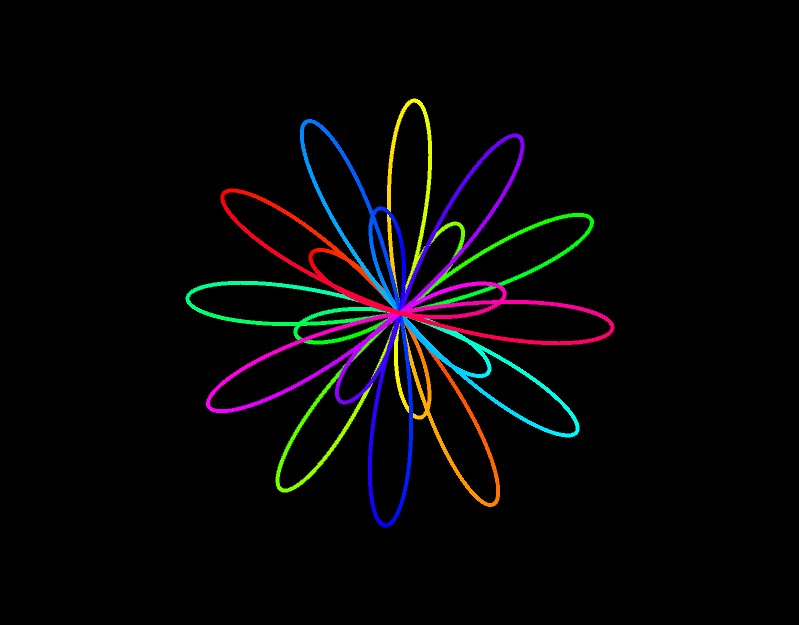
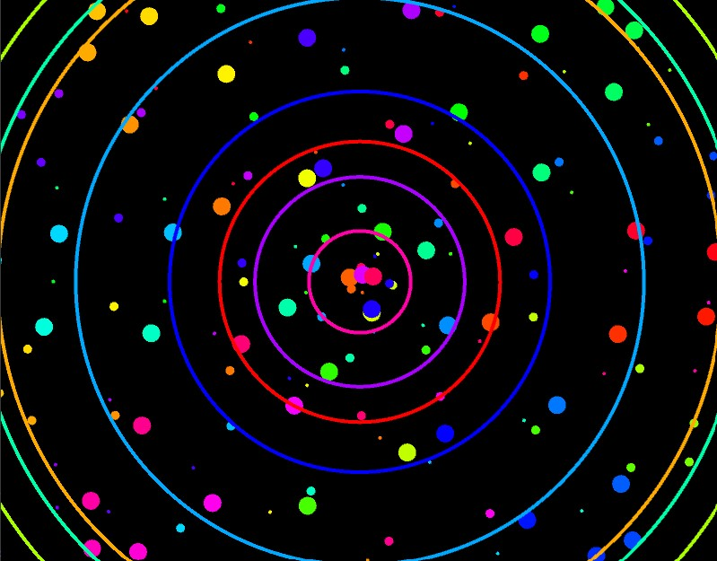

# Music Visualiser Project

Name: Sinead Manuel

Student Number: C19336081

## Description of the assignment
For this assignment, I was required to create "something beautiful while listening to music".

The song I chose to use is "Wait A Minute!" by Willow. I wanted all my visuals to contain a rainbow colour scheme to reflect the upbeat sound of the song.

I used a mix of 2D and 3D visuals in my program. I made a few of my visuals reoccur with some form of variation. For example, my first visual is of several coloured circles reacting to the music. Then in a later visual, the circles reappear but with colourful dots expanding and rotating within a circular area.

I created a flower visual using the sin and cos functions. The visual is of a colourful small flower on top of a colourful bigger flower. Both flowers react to the amplitudue of the music. The flower visual reoccurs at a later stage within the sphere visual and there are some dots that are also rotating within the sphere area.

Other visuals contained in the program include:
- Colourful square rotating in opposite directions
- Several colourful circles rotating in a circular formation and reacting to the amplitude of the music

## Instructions
- Press the spacebar to play song when there is no audio playing
- Press the spacebar to pause song when there is audio playing
- Press the left arrow key to rewind song
- Press keys 0 - 5 to view different visuals
- Key 0: Expanding Circles Visual
- Key 1: Flower visual
- Key 2: Rotating Squares visual
- Key 3: Expanding Circles with Dots visual
- Key 4: Flower and Dots inside Sphere visual
- Key 5: More Circles visual

## How it works
I created 7 classes for my different visuals. An instance of each class was created in the SineadsVisual class. I used inheritance to make SineadsVisual extend to the Visual class.
```Java
public class SineadsVisual extends Visual {
    RotatingSquares rsq;
    ExpandingCircles exc;
    Flower flo;
    MoreCircles moc;
    Dots dot;
    Sphere sph;
```

There is an instance of SineadsVisual in every visual class. This instance is used as a parameter in each visual class constructor. Below is an example of the SineadsVisual instance and the constructor in the ExpandingCircles class. Each visual class is written in a similar format.
```Java
public class ExpandingCircles {
    SineadsVisual sv;

        public ExpandingCircles(SineadsVisual sv) {
	    this.sv = sv;
        }
```

The setup method in the SineadsVisual class loads the audio file and creates objects for each visual class.
```Java
public void setup()
    {
        startMinim();
	
        loadAudio("Wait_a_Minute!.mp3");

        rsq = new RotatingSquares(this);
        exc = new ExpandingCircles(this);
        flo = new Flower(this);
        moc = new MoreCircles(this);
        dot = new Dots(this);
        sph = new Sphere(this);

        colorMode(HSB);
    }
```

The keyPressed method will check which key the user pressed. This method performs a specific action when a user presses the spacebar key, the left arrow key or any number key between 0 and 5 inclusive.
```Java
public void keyPressed()
    {
        if (keyCode == ' ')
        {
            if (getAudioPlayer().isPlaying()) {
                getAudioPlayer().pause();
            }
            else {
                getAudioPlayer().play();
            }
        }

        if(keyCode == LEFT) {
            // Rewind song
            getAudioPlayer().cue(0);
        }

        if (keyCode >= '0' && keyCode <= '5') {
            visual = keyCode - '0';
        }
    }
```

I implemented switch case statements in the draw function so the program could switch between each visual. Although there are 7 seperate visual classes, there are only 6 key options to view each visual. There are less options because I decided to combine a few visuals together.
```Java
switch (visual)
        {
            case 0:
            {
                exc.render();
                break;
            }
            case 1:
            {
                flo.render();
                break;
            }
            case 2:
            {
                // Rotates right
                camera(0, -500, 500, 0, 0, 0, 500, 0, 0);
                rsq.render();
                // Rotates left
                camera(0, -500, 500, 0, 0, 0, -500, 0, 0);
                rsq.render();
                break;
            }
            case 3:
            {                
                strokeWeight(4);
                dot.render();
                strokeWeight(10);
                dot.render();
                strokeWeight(20);
                dot.render();
                exc.render();
                break;
            }
            case 4:
            {
                sph.render();
                strokeWeight(10);
                dot.render();
                flo.render();
                break;
            }
            case 5:
            {                
                moc.render();
                break;
            }
        }
```

## What I am most proud of in the assignment
What I am most proud of in my assignment is implementing the multi-sized Dots with the ExpandingCircles visual.

I accidentally stumbled across the first version of the dots visual during the process of making the Flower visual. I drew the flower using the `points()` function in a for loop. By messing around with the incremented value at the end of the for loop, I ended up seeing many points rotating within a circular area. At first I felt that there were not as many points as I would like, so I tried to call the Dots class more than once, however the visual looked the same. Then I had the idea to attempt implementing a diffrent stroke weight every time I called the Dots class. I liked the visual a lot more but I felt like there was something missing. So I decided to combine it with the ExpandingCircles visual and I loved how it turned out.

I am also very proud of my MoreCircles visual. I originally wanted to make a kaleidoscope inspired visual. I played around with the positioning of several circles. I then placed these circles into a for loop. The visual looks crazy but I like it that way because I feel that it fits the vibe of the song.

## Images
Key 0: Expanding Circles


Key 1: Flower



Key 2: Rotating Squares


Key 3: Expanding Circles with Dots



Key 4: Flower with Dots inside of Sphere


Key 5: More Circles


## Visuals Video

Youtube: [Music Visuals - OOP Java Processing | Sinead Manuel](https://www.youtube.com/watch?v=nj5XM3YQusE)
